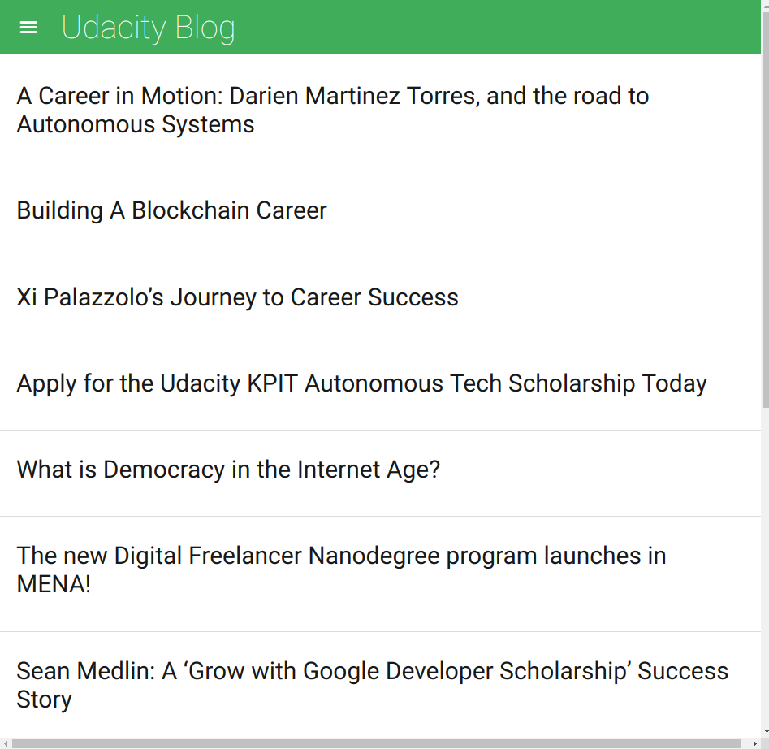
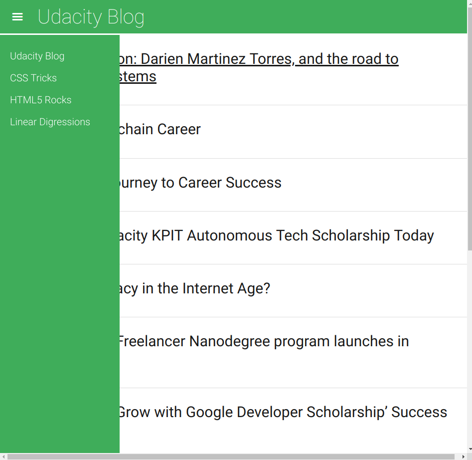

# Feed Reader Project

This project is a web-based application that reads RSS feeds.

## Getting Started

* To start using this application, you have first to either download or clone it to your machine.

```bash
git clone http://www.github.com/AhmedELaguab/feed-Reader-project
```

* Then simply open `index.html` file and start reading your favorite website's RSS feeds.

## How to use

### Add new websites to the app

* Go to the `js` folder inside the project folder.
* Open the `app.js` file with your favorite code editor.
* Add a new `object` to the `allFeeds` array.
* The `object` should has two properties `name` and `url`.
* The `name` property should be the website's name.
* The `src` propery should be the websit's RSS feeds URL.

#### Example

```javascript
var allFeeds = [
    {
        name: "the website's name",
        url: "the website RSS feed URL"
    }
];
```

### Delete a website

* Go to the `js` folder inside the project folder.
* Open the `app.js` file with your favorite code editor.
* Delete the website's array from the `allFeeds` array.

## Screenshots




## Built With

* HTML/HTML5
* CSS/CSS3
* JavaScript (+ jQuery)
* Jasmine

## Contributing

This repository is my code to pass the fourth Project of Udacity Front-End Developer Nanodegree Program. Therefore, I most likely will not accept pull requests.

For details, check out [CONTRIBUTING.md](CONTRIBUTING.md).

## Authors

* **[AhmedElaguab](https://github.com/AhmedElaguab)** - development
* **[Udacity](https://github.com/udacity)** - development